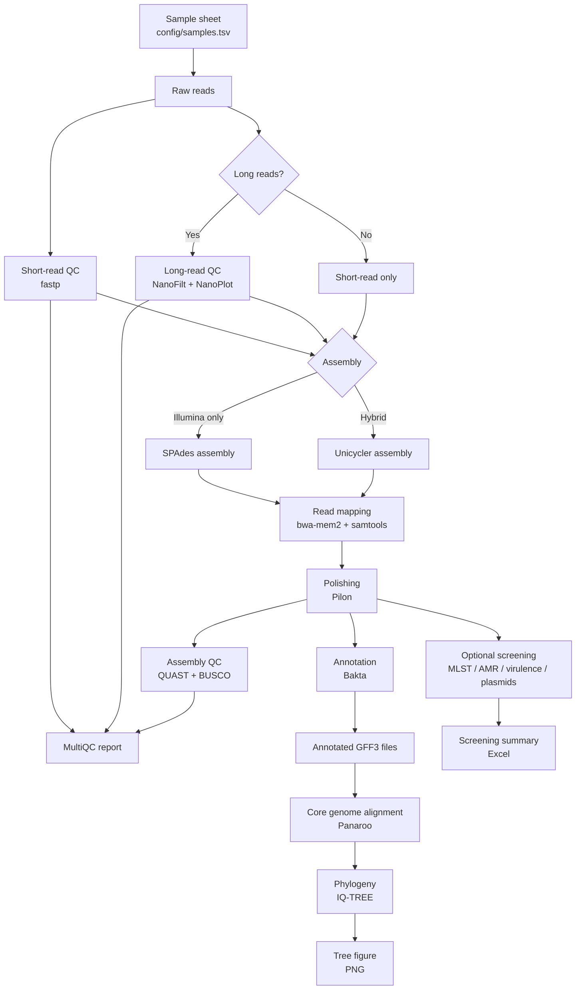
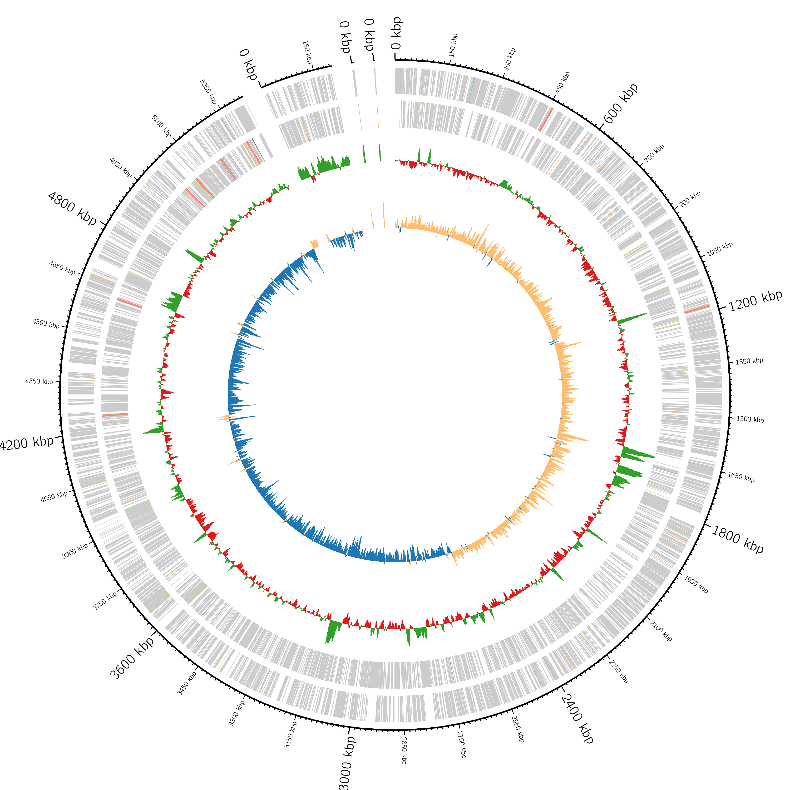

# Bacterial WGS Snakemake Workflow

Automated Snakemake workflow for bacterial whole-genome sequencing analysis from paired-end Illumina reads, with optional long-read support for hybrid assembly.

The workflow performs read QC, genome assembly, polishing, assembly QC, annotation, optional MLST/AMR/virulence/plasmid screening, and core-genome phylogeny reconstruction.

## Workflow Overview



## Example Output

Representative circular genome visualization generated from one sample.



## Main Steps

1. Quality-control paired-end Illumina reads with `fastp`.
2. Optionally filter and summarize long reads with `NanoFilt` and `NanoPlot`.
3. Assemble genomes with `SPAdes` for short-read-only samples or `Unicycler` for hybrid samples.
4. Polish assemblies with `Pilon` after read mapping with `bwa-mem2` and `samtools`.
5. Assess assembly quality with `QUAST` and completeness with `BUSCO`.
6. Annotate polished assemblies with `Bakta`.
7. Optionally screen for MLST, AMR genes, virulence genes, and plasmids.
8. Build a core-genome alignment with `Panaroo` and infer a phylogeny with `IQ-TREE`.

## Inputs

The main config file is:

```text
config/config.yaml
```

The sample sheet is configured with:

```yaml
sample_sheet: "config/samples.tsv"
```

Example `config/samples.tsv`:

```text
sample    illumina_r1                         illumina_r2                         long_reads
sample1   data/SET1/sample1_R1.fastq.gz       data/SET1/sample1_R2.fastq.gz       data/SET1/sample1_long.fastq.gz
sample2   data/SET2/sample2_R1.fastq.gz       data/SET2/sample2_R2.fastq.gz       -
```
